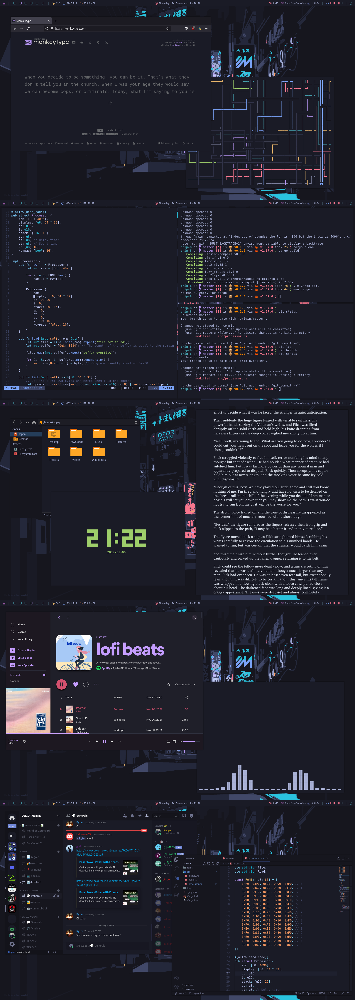

<h1 align="center">~/.dotfiles</h1>

The configuration files for my rice centered around the Tokyo Night theme.

   - **Window Manager**: [i3-gaps](https://github.com/Airblader/i3)
   
   - **Terminal**: [alacritty](https://github.com/alacritty/alacritty)
   
   - **Prompt**: [starship](https://starship.rs)
   
   - **Bar**: [polybar](https://github.com/polybar/polybar) (modified from [here](https://github.com/adi1090x/polybar-themes))
   
   - **Editors**: [nvim](https://neovim.io) & [vscode](https://code.visualstudio.com)
   
   - **Launcher & Powermenu**: [rofi](https://github.com/davatorium/rofi) (modified from [here](https://github.com/adi1090x/rofi))
   
   - **File Manager**: [thunar](https://gitlab.xfce.org/xfce/thunar)
   
   - **Music Player**: [spotify](https://www.spotify.com) with [spicetify](https://github.com/khanhas/spicetify-cli)
   
   - **Music Visualizer**: [cava](https://github.com/karlstav/cava)
   
   - **Document Reader**: [zathura](https://pwmt.org/projects/zathura)
   
   - **Book**: [The Sword of Shannara](https://en.wikipedia.org/wiki/The_Sword_of_Shannara)
